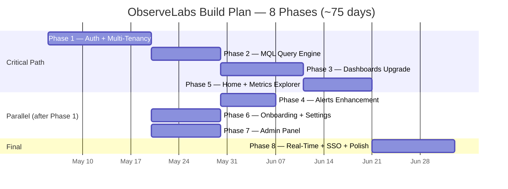

# ObserveLabs Master Build Plan

> Evolution from NeoGuard POC to production multi-tenant SaaS monitoring platform.
>
> **Baseline**: 79 Python files, 7 React pages, 630 tests, AWS+Azure collection, 6 alert channels, API key auth.
> **Stack**: Python 3.14 / FastAPI, TimescaleDB (pg16), ClickHouse 24.8, React 18 / TypeScript / Vite, Redis.

---

## Timeline Overview

**Critical path**: Phase 1 -> 2 -> 3 -> 5 -> 8
**Parallel after Phase 1**: Phases 6 and 7 run concurrently with the critical path.
**Phase 4** starts after Phase 2 and runs parallel to Phase 3.
**Total estimated**: 70-87 days (75 nominal).

---

## Phase 1: Auth + Multi-Tenancy Foundation

| Attribute | Detail |
|-----------|--------|
| **Effort** | 12-15 days |
| **Dependencies** | None (foundation phase) |

### Goals

User can sign up with email and password, log in, create a tenant, invite team members, and switch between tenants. All existing data is tenant-isolated via row-level security. Existing API key auth continues to work unchanged.

### Deliverables

| Stream | Files / Features |
|--------|-----------------|
| **DB (Stream A)** | New tables: `tenants`, `users`, `tenant_memberships`, `user_invites`, `oauth_identities`, `audit_log`, `platform_audit_log`, `security_log`. Alembic migrations for all. RLS policies on every existing data table. Migrate `tenant_id` from VARCHAR to UUID across all tables. |
| **Backend (Stream A)** | Auth routes: `POST /auth/signup`, `POST /auth/login`, `POST /auth/logout`, `POST /auth/password-reset`, `POST /auth/password-reset/confirm`. Session middleware (Redis-backed, HttpOnly cookie). Tenant context middleware (extracts tenant from session or API key, sets `app.current_tenant_id` on connection). CSRF protection middleware. Password hashing with Argon2id (via `argon2-cffi`). |
| **Backend (Stream A)** | Tenant routes: `POST /tenants`, `GET /tenants`, `PATCH /tenants/:id`. Membership routes: `POST /tenants/:id/invite`, `GET /tenants/:id/members`, `DELETE /tenants/:id/members/:uid`, `PATCH /tenants/:id/members/:uid/role`. |
| **Frontend (Stream B)** | Login page, signup page, password reset page, tenant switcher component (header dropdown), session management (token refresh, redirect on 401). Protected route wrapper. |
| **Infrastructure** | Add Redis to `docker-compose.yml`. Config: `NEOGUARD_REDIS_URL`, `NEOGUARD_SESSION_SECRET`, `NEOGUARD_SESSION_TTL_SECONDS`. |
| **Tests** | Adversarial multi-tenant isolation tests (user A cannot read user B's data even with forged tenant_id). Auth unit tests. Session expiry tests. RLS bypass attempt tests. Target: +80 tests. |

### Parallel Streams

- **Stream A**: DB schema + migrations + backend auth + tenant APIs
- **Stream B**: Frontend login/signup pages + session management + tenant switcher

### Exit Criteria

- [ ] User can sign up, log in, create an API key, and see only their own tenant's data
- [ ] Existing 630 tests adapted for auth context and still passing
- [ ] RLS adversarial tests pass (minimum 10 cross-tenant attack vectors tested)
- [ ] Redis session store operational; session expires after configured TTL
- [ ] Password hashing uses Argon2id with OWASP-recommended parameters

---

## Phase 2: MQL Query Engine + API Improvements

| Attribute | Detail |
|-----------|--------|
| **Effort** | 8-10 days |
| **Dependencies** | Phase 1 (tenant context middleware required) |

### Goals

All metric queries use MQL syntax. Typeahead returns metric names and tag values. Batch query endpoint exists. All list endpoints use cursor-based pagination.

### Deliverables

| Stream | Files / Features |
|--------|-----------------|
| **Parser + Compiler (Stream A)** | Hand-rolled recursive descent MQL parser. AST node types: `MetricQuery`, `Filter`, `Aggregation`, `GroupBy`, `Function`. MQL-to-SQL compiler with automatic `tenant_id` injection at compile time (never trust client). Support: `avg`, `min`, `max`, `sum`, `count`, `last`, `p95`, `p99`, `rate`, `diff`. |
| **Metadata + Cache (Stream B)** | `GET /api/v1/metadata/metrics` (tenant-scoped, Redis-cached 60s). `GET /api/v1/metadata/tags/:metric` (tenant-scoped, Redis-cached 60s). Cache invalidation on new metric ingestion. |
| **Batch + Pagination (Stream C)** | `POST /api/v1/query/batch` (up to 20 queries per request, parallel execution). Cursor-based pagination on all existing list endpoints (replace offset-based). Standard error envelope: `{ "error": { "code", "message", "details" }, "request_id" }`. Idempotency key middleware (`Idempotency-Key` header, Redis-backed, 24h TTL). |

### Parallel Streams

- **Stream A**: MQL parser + compiler + unit tests
- **Stream B**: Metadata endpoints + Redis caching layer
- **Stream C**: Cursor pagination migration + error envelope + idempotency

### Exit Criteria

- [ ] MQL queries execute end-to-end with tenant isolation verified
- [ ] `POST /api/v1/query/batch` handles 10 queries in < 800ms p95
- [ ] Typeahead returns metric names in < 200ms p95
- [ ] All list endpoints return `next_cursor` / `prev_cursor` instead of `offset`
- [ ] Duplicate POST with same idempotency key returns cached response
- [ ] Target: +60 tests (parser edge cases, compiler SQL injection attempts, batch limits)

---

## Phase 3: Dashboards Upgrade

| Attribute | Detail |
|-----------|--------|
| **Effort** | 10-12 days |
| **Dependencies** | Phase 2 (MQL engine for widget queries) |

### Goals

User can create dashboards with four widget types, drag-and-resize layout, template variables, shared time controls, and shareable URLs.

### Deliverables

| Stream | Files / Features |
|--------|-----------------|
| **Backend (Stream A)** | New DB schema: `dashboards` (with `layout_json`, `variables_json`, `tenant_id`, RLS), `widgets` (with `query_mql`, `widget_type`, `config_json`). Dashboard CRUD: `POST/GET/PATCH/DELETE /api/v1/dashboards`. Widget CRUD nested under dashboard. Variable resolution engine (substitutes `$variable` in MQL before compilation). Query execution: resolves variables, compiles MQL, executes, returns series data. Quota enforcement: max dashboards per tier, max widgets per dashboard. |
| **Frontend (Stream B)** | Grid layout via `react-grid-layout` (drag, resize, responsive breakpoints). Four widget renderers: `timeseries` (Recharts line/area/bar), `single_value` (big number + sparkline), `top_list` (sorted table), `text` (markdown). Variable dropdowns (populated from metadata API). Unified time range picker with URL state sync (`?from=&to=&tz=`). Widget editor drawer (MQL input, chart config, thresholds). Dashboard clone and export (JSON). |
| **Authorization** | Role-based: `viewer` = read-only, `editor` = create/edit, `admin` = delete + share. Dashboard-level sharing within tenant. |

### Parallel Streams

- **Stream A**: Backend dashboard/widget CRUD + variable resolution + quota enforcement
- **Stream B**: Frontend grid layout + widget renderers + editor drawer

### Exit Criteria

- [ ] 10-widget dashboard renders in < 2s (measured via Performance API)
- [ ] Drag-and-resize layout persists correctly across page reloads
- [ ] Variables filter all widgets simultaneously on change
- [ ] URL sharing works: copy URL, open in new tab, same dashboard state loads
- [ ] Quota limits enforced (returns 429 with upgrade message)
- [ ] Target: +50 tests (CRUD, variable injection safety, layout persistence)

---

## Phase 4: Alerts Enhancement + Notifications

| Attribute | Detail |
|-----------|--------|
| **Effort** | 6-8 days |
| **Dependencies** | Phase 2 (MQL compiler), Phase 1 (auth) |

### Goals

Alert rules use MQL for metric evaluation. Notification delivery is tracked and visible. All six channels are testable via UI. Maintenance windows allow tenant-wide muting.

### Deliverables

| Stream | Files / Features |
|--------|-----------------|
| **Engine Migration (Stream A)** | Refactor `AlertEngine` to compile alert rule conditions via MQL compiler (replaces raw SQL construction). Tenant-scoped evaluation (engine iterates per-tenant). Evaluation result caching to avoid redundant queries for rules sharing the same metric. |
| **Notification Tracking (Stream B)** | New table: `notification_deliveries` (delivery_id, alert_event_id, channel_id, status, attempt_count, response_code, response_body, created_at, delivered_at). API: `GET /api/v1/alerts/events/:id/deliveries`. Test notification button: `POST /api/v1/notifications/channels/:id/test` (sends synthetic payload). |
| **Maintenance Windows** | New table: `maintenance_windows` (tenant_id, start_at, end_at, reason, created_by, scope_filter). CRUD endpoints. Alert engine skips evaluation for resources matching active window scope. |
| **Frontend** | Delivery status column on alert events table. Test notification button on channel config. Maintenance window management UI (create, list, cancel). |

### Parallel Streams

- **Stream A**: Alert engine MQL migration + evaluation caching
- **Stream B**: Notification delivery tracking + test button + maintenance windows

### Exit Criteria

- [ ] Alert engine evaluates all rules via MQL compiler (zero raw SQL in eval path)
- [ ] Test button works for all 6 channel types (webhook, Slack, email, Freshdesk, PagerDuty, MS Teams)
- [ ] Delivery history visible per alert event in UI
- [ ] Maintenance window suppresses alerts for matching resources
- [ ] Target: +40 tests (MQL eval, delivery tracking, maintenance window overlap)

---

## Phase 5: Home + Metrics Explorer + Infrastructure

| Attribute | Detail |
|-----------|--------|
| **Effort** | 8-10 days |
| **Dependencies** | Phase 3 (dashboards for pin/save flow), Phase 2 (MQL for explorer) |

### Goals

Home page shows real-time tenant health at a glance. Metrics explorer enables ad-hoc investigation with typeahead. Infrastructure page shows resource detail with relevant metrics.

### Deliverables

| Stream | Files / Features |
|--------|-----------------|
| **Home Page (Stream A)** | Health banner (ok / degraded / critical based on firing alert count). Firing alerts panel (top 5 with severity, linked to alert detail). Favorite dashboards (pin/unpin, stored in `home_pins` table). Quick stats: resource count, metric throughput, active alerts, uptime. Activity feed (last 20 events from `activity_events` table: deploys, alert state changes, user actions). Quota usage indicators (resources, metrics, dashboards vs. tier limits). |
| **Metrics Explorer (Stream B)** | MQL query editor with syntax highlighting and typeahead (metric names, tag keys, tag values from metadata API). Multi-query overlay (up to 5 queries on one chart). Chart type switcher (line, area, stacked area, bar). Time range selector synced to URL. Save-to-dashboard flow (select target dashboard, create widget from current query). Export CSV. |
| **Infrastructure (Stream C)** | Resource detail page (`/infrastructure/:provider/:type/:id`): metadata table, relevant metrics (auto-selected by resource type), recent alerts, discovery timestamp, tags. Discovery status UI: last run time per region, success/failure counts, next scheduled run. |

### Parallel Streams

- **Stream A**: Home page backend + frontend
- **Stream B**: Metrics explorer frontend + typeahead integration
- **Stream C**: Infrastructure detail pages + discovery status

### Exit Criteria

- [ ] Home page loads in < 1.5s with real data (measured via Performance API)
- [ ] Explorer queries execute in < 1s for 1h window
- [ ] Resource detail page shows relevant metrics for the selected resource
- [ ] Pin/unpin dashboard persists across sessions
- [ ] Activity feed updates within 30s of event occurrence
- [ ] Target: +45 tests (home data aggregation, explorer query building, resource detail)

---

## Phase 6: Onboarding + Settings Enhancement

| Attribute | Detail |
|-----------|--------|
| **Effort** | 8-10 days |
| **Dependencies** | Phase 1 (auth), Phase 3 (dashboards for starter dashboard generation) |

### Goals

New user goes from sign-up to a working dashboard with real metrics in under 5 minutes. Settings page is fully functional with user management and audit log.

### Deliverables

| Stream | Files / Features |
|--------|-----------------|
| **Onboarding Flow (Stream A)** | Step 1: Signup + email verification (`email_verifications` table, token-based). Step 2: Connect AWS (guided CloudFormation stack launch with pre-filled external ID, poll for role validation). Step 3: Auto-discovery triggered on successful connection. Step 4: Starter dashboard generated (pre-built layout with key metrics for discovered resource types). Step 5: Coach marks (first-visit tooltips on key UI elements, stored in `user_onboarding` table). |
| **Email Infrastructure (Stream A)** | Email service abstraction (SES in prod, SMTP in dev, console logger in test). Templates: verification, password reset, invite, alert notification. Rate limiting per recipient. |
| **Settings Enhancement (Stream B)** | User profile: display name, email change (re-verify), password change, timezone, notification preferences. Tenant settings: name, default retention, default timezone. User management: invite by email, list members, change role, remove member. Integration management: AWS accounts list, Azure subscriptions list, connection status, re-validate, delete. Audit log viewer: searchable, filterable by actor/action/resource, paginated. |

### Parallel Streams

- **Stream A**: Onboarding wizard + email infrastructure
- **Stream B**: Settings page enhancement (split `SettingsPage.tsx` into sub-components)

### Exit Criteria

- [ ] Sign up to first dashboard with real data in < 5 minutes (timed end-to-end)
- [ ] Email verification required before data access
- [ ] Invite flow: invitee receives email, clicks link, sets password, sees tenant data
- [ ] Audit log is searchable by actor, action, and time range
- [ ] `SettingsPage.tsx` split into < 300 lines per sub-component
- [ ] Target: +50 tests (onboarding flow, email sending, invite lifecycle, audit queries)

---

## Phase 7: Admin Panel

| Attribute | Detail |
|-----------|--------|
| **Effort** | 8-10 days |
| **Dependencies** | Phase 1 (auth + tenancy) |

### Goals

Platform operators can manage tenants, impersonate users for support, override quotas, and handle GDPR data requests. All admin actions are audited.

### Deliverables

| Stream | Files / Features |
|--------|-----------------|
| **Admin API (Stream A)** | Routes under `/admin/*` with `platform_admin` scope requirement. Tenant management: list (with search, sort, filter by status), detail view (resource counts, metric throughput, billing estimate), create, suspend (grace period warning), reactivate, delete (soft-delete with 30-day grace, then hard purge). Quota override: `POST /admin/tenants/:id/quota-override` (time-bound, auto-expiry via background job). |
| **Impersonation (Stream A)** | `POST /admin/impersonate` (requires: target user ID, reason string, max duration). Creates `impersonation_sessions` record. Impersonated session is read-only (all write endpoints return 403). Auto-expires after duration. All actions during impersonation logged to `platform_audit_log` with `impersonated_by` field. Visual indicator in UI (persistent banner: "Viewing as {user} - Read Only"). |
| **GDPR (Stream B)** | Data export job: `POST /admin/tenants/:id/export` -> async job -> generates ZIP -> download link (signed URL, 24h expiry). Data deletion job: `POST /admin/tenants/:id/delete-data` -> async job -> purges from TimescaleDB + ClickHouse -> confirmation. Tables: `data_export_jobs`, `data_deletion_jobs` with status tracking. |
| **Frontend (Stream B)** | Admin layout with red accent (visual distinction from user UI). Tenant list with search and status filters. Tenant detail page. Impersonation button with reason modal and confirmation. Platform audit log viewer. Super admin bootstrap: `python -m neoguard.cli.bootstrap_admin --email admin@example.com`. |

### Parallel Streams

- **Stream A**: Admin API + impersonation + tenant management
- **Stream B**: GDPR jobs + admin frontend

### Exit Criteria

- [ ] Admin can list tenants, view detail, suspend, reactivate
- [ ] Impersonation creates read-only session, logged with reason
- [ ] All admin actions appear in platform audit log
- [ ] Destructive actions (suspend, delete) require typing target tenant name to confirm
- [ ] GDPR export produces downloadable ZIP within 5 minutes for < 1GB tenant
- [ ] Target: +55 tests (admin RBAC, impersonation isolation, GDPR job lifecycle)

---

## Phase 8: Real-Time + SSO + Polish

| Attribute | Detail |
|-----------|--------|
| **Effort** | 10-12 days |
| **Dependencies** | All prior phases |

### Goals

Production-ready release. Live dashboard updates. SSO for enterprise users. Performance verified against budgets. Accessibility passing. E2E test coverage on critical paths.

### Deliverables

| Stream | Files / Features |
|--------|-----------------|
| **Real-Time (Stream A)** | WebSocket endpoint: `WS /api/v1/ws/dashboard/:id` (tenant-authenticated via ticket token). Redis pub/sub for metric update fan-out. Client reconnection with exponential backoff. Auto-refresh toggle on dashboards (10s / 30s / 1m / 5m intervals). Connection status indicator in UI. |
| **SSO (Stream B)** | Google OAuth 2.0 flow (signup + login, account linking for existing users). MFA via TOTP (`pyotp`): setup flow with QR code, backup codes (10, hashed), enforcement policy per tenant. `oauth_identities` table linking (created in Phase 1). Azure AD SSO and AWS IAM Identity Center SSO (stretch goal, can defer to post-launch). |
| **Performance (Stream C)** | Lighthouse audit: target > 90 on all four scores. Load testing with `locust`: 100 concurrent users, verify p99 < 200ms on read endpoints. `EXPLAIN ANALYZE` on all hot queries, add missing indexes. Bundle analysis: target < 500KB gzipped initial load. |
| **Quality (Stream C)** | Accessibility audit via `axe-core`: zero critical/serious violations. Keyboard navigation for all interactive elements. ARIA labels on all form controls and data tables. E2E tests via Playwright: login, create dashboard, add widget, create alert rule, onboarding flow (5 critical paths minimum). |
| **Production (Stream D)** | Multi-stage Dockerfile (builder -> runtime, target < 150MB image). `docker-compose.prod.yml` with resource limits, health checks, restart policies. CORS lock-down to configured origins. Rate limit tuning for production load. Security headers (CSP, HSTS, X-Frame-Options). |

### Parallel Streams

- **Stream A**: WebSocket infrastructure + dashboard live mode
- **Stream B**: OAuth + MFA implementation
- **Stream C**: Performance hardening + accessibility + E2E tests
- **Stream D**: Production Dockerfile + security hardening

### Exit Criteria

- [ ] Dashboard live mode updates widgets within 5s of new data ingestion
- [ ] Google OAuth login works end-to-end (new user + existing user linking)
- [ ] MFA setup and enforcement works (TOTP + backup codes)
- [ ] Lighthouse scores > 90 (Performance, Accessibility, Best Practices, SEO)
- [ ] All performance budgets from Section 10 of CLAUDE.md met under load
- [ ] Zero critical/serious axe-core violations
- [ ] 5+ Playwright E2E tests passing on critical paths
- [ ] Production Docker image < 150MB, starts in < 10s
- [ ] Target: +60 tests (WebSocket auth, OAuth flow, MFA, E2E)

---

## Summary

| Phase | Name | Effort (days) | Dependencies | New Tests |
|-------|------|:-------------:|--------------|:---------:|
| 1 | Auth + Multi-Tenancy Foundation | 12-15 | None | +80 |
| 2 | MQL Query Engine + API Improvements | 8-10 | P1 | +60 |
| 3 | Dashboards Upgrade | 10-12 | P2 | +50 |
| 4 | Alerts Enhancement + Notifications | 6-8 | P1, P2 | +40 |
| 5 | Home + Metrics Explorer + Infrastructure | 8-10 | P2, P3 | +45 |
| 6 | Onboarding + Settings Enhancement | 8-10 | P1, P3 | +50 |
| 7 | Admin Panel | 8-10 | P1 | +55 |
| 8 | Real-Time + SSO + Polish | 10-12 | All | +60 |
| **Total** | | **70-87** | | **+440** |

**Final test count**: ~1,070 (630 existing + 440 new).

### Risk Register

| Risk | Likelihood | Impact | Mitigation |
|------|:----------:|:------:|------------|
| RLS migration breaks existing queries | Medium | High | Run full test suite after each migration step; staged rollout per table |
| MQL parser edge cases cause SQL injection | Low | Critical | Parameterized queries only; compiler never interpolates user strings into SQL; fuzzing tests |
| react-grid-layout performance with 20+ widgets | Medium | Medium | Virtualize off-screen widgets; limit to 20 widgets per dashboard |
| WebSocket scaling under concurrent tenants | Medium | Medium | Redis pub/sub per-tenant channel; connection limits per user |
| Phase 1 overruns delay entire critical path | Medium | High | Timebox auth to 15 days hard cap; defer OAuth to Phase 8 (already planned) |

### Key Decisions Locked

1. **Auth**: Session-based (Redis) for browser, API key for programmatic access. No JWT.
2. **MQL**: Hand-rolled parser, not a grammar generator. Keeps dependency count low and error messages precise.
3. **Real-time**: WebSocket over SSE. Bidirectional needed for future features (collaborative editing).
4. **Multi-tenancy**: Shared schema with RLS, not schema-per-tenant. Simpler ops at current scale target.
5. **GDPR**: Async job-based, not synchronous delete. Large tenants could have millions of rows.
