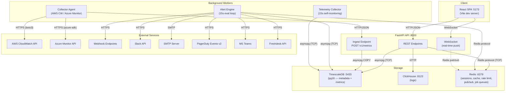
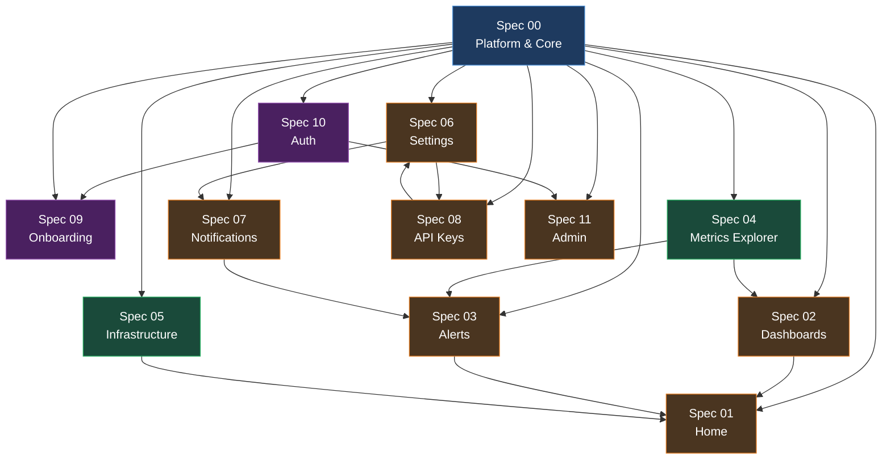

# ObserveLabs Integration Map

> Cross-spec entity relationships, service topology, dependency graph, shared contracts, conflicts, and gaps.

---

## 1. Entity-Relationship Diagram

```mermaid
erDiagram
    Platform ||--o{ Tenant : "hosts (1:N)"
    Tenant {
        uuid id PK
        string slug UK
        string name
        enum tier "free | pro | enterprise"
        enum status "active | suspended | pending_deletion"
        jsonb quotas
    }

    Tenant }o--o{ User : "tenant_memberships (M:N)"
    User {
        uuid id PK
        string email UK
        string name
        boolean is_super_admin
        enum platform_role "platform_owner | admin | support | billing"
    }

    User ||--o{ OAuthIdentity : "linked providers (1:N)"
    OAuthIdentity {
        uuid id PK
        uuid user_id FK
        enum provider "google | github"
        string provider_uid
    }

    User ||--o{ Session : "active sessions (1:N, Redis)"
    Session {
        string session_id PK
        uuid user_id FK
        datetime expires_at "30d sliding | 4h admin absolute"
    }

    Tenant ||--o{ Dashboard : "owns (1:N)"
    Dashboard ||--o{ Widget : "contains (1:N)"
    Widget {
        uuid id PK
        uuid dashboard_id FK
        jsonb queries "MQL AST"
        jsonb layout "grid x, y, w, h"
    }

    Tenant ||--o{ AlertRule : "owns (1:N)"
    AlertRule {
        uuid id PK
        enum generation "gen1_threshold | gen2_anomaly | gen2_forecast | gen2_composite"
    }
    AlertRule ||--|| AlertState : "current state (1:1)"
    AlertState {
        enum state "ok | pending | firing | resolved | nodata"
    }
    AlertRule ||--o{ AlertHistory : "transitions (1:N)"
    AlertRule }o--o{ NotificationChannel : "alert_rule_channels (M:N)"
    AlertRule ||--o| MLModel : "gen2 model (1:1)"
    AlertRule ||--o{ MLFeedback : "gen2 feedback (1:N)"
    AlertRule ||--o{ Incident : "gen2 grouping (1:N)"

    Tenant ||--o{ NotificationChannel : "owns (1:N)"
    NotificationChannel {
        uuid id PK
        enum type "webhook | slack | email | freshdesk | pagerduty | msteams"
    }

    Tenant ||--o{ Integration : "cloud accounts (1:N)"
    Integration {
        uuid id PK
        enum provider "aws | azure"
        string account_id
    }
    Integration ||--o{ Resource : "discovered (1:N)"

    Tenant ||--o{ APIKey : "owns (1:N)"
    APIKey {
        uuid id PK
        string prefix
        string hash "Argon2id (spec) | SHA-256 (current)"
        enum scope "ingest | read | admin"
    }

    Tenant ||--o{ AuditLog : "tenant audit (1:N)"
    Tenant ||--o{ HomePins : "per-user favorites (1:N)"
    Tenant ||--o{ ActivityEvent : "activity feed (1:N)"
    Tenant ||--o{ MaintenanceWindow : "gen2 silences (1:N)"
    Platform ||--o{ PlatformAuditLog : "platform audit (1:N, append-only)"
    Tenant ||--o{ Metric : "time-series (TimescaleDB hypertable)"
```

---

## 2. Service Topology

---

## 3. Cross-Spec Dependency DAG

**Build order (topological sort):** Spec 00 → Spec 10 → Spec 04, Spec 05 → Spec 08 → Spec 06 → Spec 07 → Spec 09, Spec 02 → Spec 03, Spec 11 → Spec 01

---

## 4. Shared Contracts

These types appear across multiple specs and **must** be defined exactly once in a shared module.

| Contract | Source Spec | Consumers | Notes |
|---|---|---|---|
| `Tenant` (id, slug, name, tier, status, quotas) | 00 | All specs | Foundation entity, every request scoped to tenant |
| `User` (id, email, name, roles, is_super_admin) | 00, 10 | All specs | Platform role + per-tenant role via membership |
| `TenantMembership` (user_id, tenant_id, role) | 00, 10 | 06, 09, 11 | M:N join with role enum: owner/admin/member/viewer |
| `MetricQuery` / MQL AST | 00 ss6 | 02, 03, 04, 08 | Single parser/compiler, shared AST type |
| `TimeRange` (relative + absolute) | 00 ss7 | 01, 02, 03, 04 | `{type: "relative", value: "1h"}` or `{from, to}` |
| `ApiError` envelope | 00 ss8.4 | All specs | `{error: {code, message, details, correlation_id}}` |
| `AuditEvent` | 00 | 06, 11 | Three tables: audit_log, platform_audit_log, security_log |
| `RequestContext` | 00 | All specs | Middleware-injected: user_id, tenant_id, is_super_admin, correlation_id |
| `StateBadge` enum | 00 | 01, 03, 05 | `ok | warn | error | info | neutral | nodata` |
| `Pagination` (cursor-based) | 00 | All list endpoints | `{next_cursor, has_more, items[]}` |

---

## 5. Conflict Detection

Decisions required where specs diverge from the current implementation.

| # | Area | Spec Says | Current Implementation | Impact | Recommendation |
|---|---|---|---|---|---|
| 1 | **ID format** | UUIDv7 (time-ordered, RFC 9562) | ULID (`python-ulid`) | Both time-ordered, binary-compatible | Migrate to UUIDv7 for spec compliance; existing ULIDs can coexist during transition |
| 2 | **CSS framework** | Shadcn/ui + Tailwind CSS | Custom SCSS design system | Major frontend migration | Phase this in; existing pages work, new pages use Shadcn |
| 3 | **API key format** | `obl_live_<32 base62>` + Argon2id hash | ULID-based keys + SHA-256 hash | Breaking change for existing keys | Version the key format; support both during migration window |
| 4 | **State management** | Zustand + TanStack Query | useState/useEffect hooks | Incremental migration possible | Adopt TanStack Query first (biggest ROI), then Zustand |
| 5 | **ORM layer** | SQLAlchemy 2.0 + raw SQL escape hatch | Raw asyncpg only | No model layer, no migrations via SA | Add SQLAlchemy models for new entities; keep asyncpg for hot-path queries |
| 6 | **Pagination** | Cursor-based (keyset) | Offset-based (LIMIT/OFFSET) | Performance degrades at high offsets | Migrate list endpoints to cursor-based; use ULID/UUIDv7 as cursor |
| 7 | **Background jobs** | Redis Streams consumer groups | In-process asyncio tasks | No persistence, no retry, no scaling | Add Redis Streams for alert eval + notification dispatch |
| 8 | **Password hashing** | Argon2id | N/A (no password auth yet) | Clean-slate opportunity | Implement Argon2id from day one when adding password auth |

---

## 6. Missing Pieces

Infrastructure and capabilities that specs collectively assume but are not yet implemented.

| # | Gap | Required By Specs | Severity | Effort |
|---|---|---|---|---|
| 1 | **Redis** — not in current stack | 00, 03, 10 (sessions, cache, rate limit, pub/sub, job queues) | Critical | Medium — add to Docker Compose, add `redis.asyncio` client |
| 2 | **User authentication** — no passwords, no OAuth, no sessions | 10, 09 | Critical | Large — full auth system with registration, login, OAuth, sessions |
| 3 | **MQL parser/compiler** — no query language | 00, 02, 03, 04 | Critical | Large — lexer, parser, AST, compiler to SQL |
| 4 | **Row-Level Security** — tenant_id plumbed but no RLS policies | 00 | High | Medium — Postgres RLS policies on all tables |
| 5 | **Feature flags** — no infrastructure | 00 | Medium | Small — simple DB table + middleware check |
| 6 | **Audit logging** — no structured audit trail | 00, 06, 11 | High | Medium — append-only tables + middleware hooks |
| 7 | **CSRF protection** — no tokens | 10 | High | Small — double-submit cookie pattern |
| 8 | **Idempotency keys** — no deduplication | 00 | Medium | Small — idempotency_key column + upsert logic |
| 9 | **Email infrastructure** — no SMTP sender | 07, 10 | High | Medium — async email sender, templates, verification flows |
| 10 | **GDPR pipeline** — no data export/deletion | 00, 11 | Medium | Large — tenant data export, right-to-erasure, retention enforcement |
| 11 | **CSP headers** — no Content-Security-Policy | 00 | Medium | Small — middleware to set security headers |
